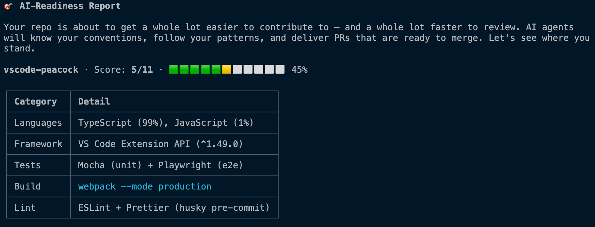
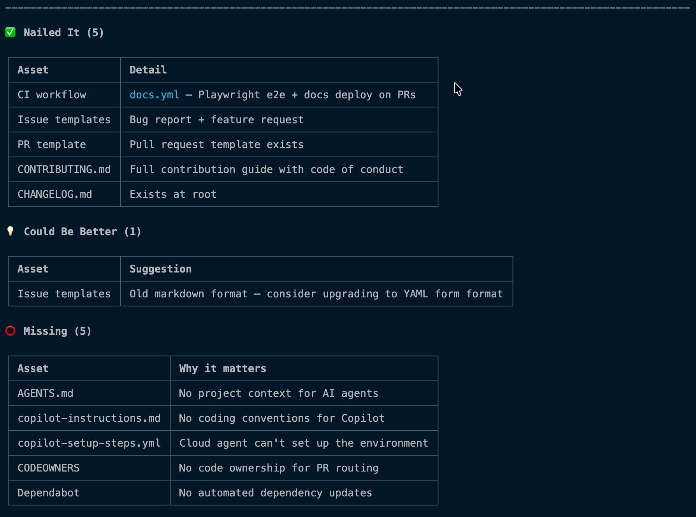
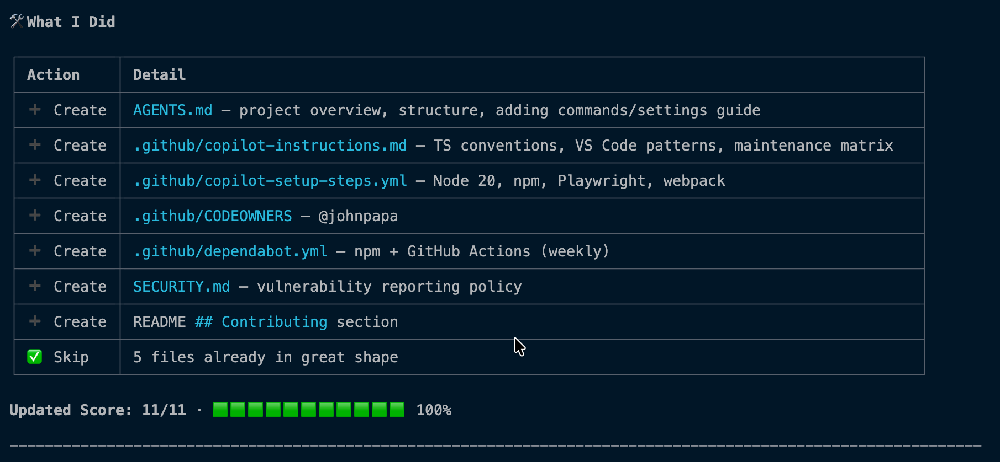
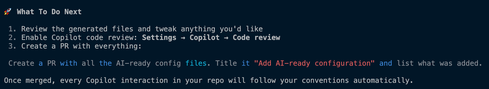

# AI Ready (a Copilot CLI Plugin)

[](https://github.com/johnpapa/ai-ready)

> ⚠️ **Alpha** — This plugin is a work in progress. It works, but expect rough edges. Feedback and contributions welcome.

A Copilot CLI plugin that analyzes your repository and generates the configuration files AI agents need to contribute correctly. **GitHub-native** — it auto-discovers your repo's context, community health, and PR review patterns without you explaining anything.

## Quick Start

Install the plugin:

```bash
copilot plugin install johnpapa/ai-ready
```

Run it:

```
copilot "make this repo ai-ready"
```

The plugin analyzes your code, CI, tests, docs, and structure, then generates assets customized to your project — not generic templates.

## What to Expect

After you run the skill, here's what happens:

**1. Analysis** — the skill scans your repo using GitHub's APIs and your local codebase. You get a score, tech profile, and progress bar — no questions asked.



**2. Assessment** — every asset is categorized as nailed, could be better, or missing. You see exactly where you stand.



**3. Generation** — the skill creates every missing file, customized to your repo's actual patterns. The progress bar updates to show the improvement.



**4. Next steps** — clear actions: review, enable Copilot code review, add an AI-Ready badge, and a ready-to-use prompt to create the PR.



## Why

Contributors (human and AI) show up to your repo and don't know the conventions. They submit PRs that miss tests, break patterns, skip docs. You leave the same review comments on every PR. AI agents make this more challenging — they generate PRs faster, but without context, those PRs create _more_ review burden.

It's the same gap from both sides: **contributors don't know what maintainers expect, and maintainers keep re-teaching it.** This plugin closes that gap by generating repo-level configuration that teaches everyone — human and AI — how to work in the repo correctly. It even mines your PR review comments for repeated feedback and turns them into automated conventions. The result: a 45-minute review becomes a 5-minute review.

### Built from Real Maintainer Experience

This plugin isn't theoretical — it's shaped by [John Papa](https://github.com/johnpapa)'s experience maintaining popular open source projects and repos at large enterprises. The skill is tuned to prioritize what actually reduces review burden: maintenance matrices that catch the files contributors always forget, conventions mined from the PR feedback you're tired of repeating, and CI that catches problems before you have to.

## How It Works — GitHub-Native by Default

You shouldn't have to explain to an AI tool that you're in a GitHub repo. This plugin assumes it, and leverages everything GitHub already knows about your project.

### Auto-Discovery (zero user input)

The skill starts by pulling context directly from GitHub — no questions asked:

| What it discovers | How | Why it matters |
|------------------|-----|----------------|
| Repo description, topics, languages | GitHub API | Knows what your project is without reading every file |
| Community health score | GitHub API | Instantly knows which config files are missing |
| Contributors | GitHub API | Team size, contribution patterns |
| Recent merged PRs | GitHub API | Understands what typical contributions look like |
| **PR review comments** | GitHub API | **Turns your repeated review feedback into automated conventions** |
| CI/CD workflows | GitHub Actions API | Knows your build/test pipeline |
| Releases | GitHub API | Understands versioning and release cadence |

It then scans your local codebase for deeper details — manifest files, test configs, directory structure, existing AI configuration — and combines both into a complete picture.

### PR Review Mining — The Killer Feature

This is the highest-value thing the plugin does. It reads your recent PR review threads and looks for **repeated feedback** — the same comments you leave on every PR:

- _"Please add tests for new features"_ → becomes a test convention rule
- _"Use the X pattern instead of Y"_ → becomes a coding convention rule
- _"Don't forget to update the changelog"_ → becomes a maintenance matrix entry
- _"This breaks on mobile, check responsive layout"_ → becomes a screen size rule

These mined conventions go directly into `copilot-instructions.md`. The next AI-generated PR follows those rules automatically. You stop repeating yourself.

### What Gets Generated

| Asset | What It Does |
| --- | --- |
| **`AGENTS.md`** | Project context for the coding agent — repo structure, build/test commands, architectural decisions |
| **`.github/copilot-instructions.md`** | Coding conventions for all Copilot interactions — Chat, completions, PR reviews, CLI |
| **`.github/copilot-setup-steps.yml`** | Cloud agent environment setup — dependencies, tools, build steps |
| **CI workflow** | PR validation pipeline — build, test, typecheck |
| **Issue templates** | Structured proposals, bug reports, feature requests |
| **README contributing section** | Onramp for new contributors with links to AGENTS.md |
| **Maintenance matrix** | What to update when code changes — cross-referenced file dependencies |
| **CODEOWNERS** | Code ownership for automatic PR review routing |
| **Dependabot** | Automated dependency updates |
| **SECURITY.md** | Vulnerability reporting policy |

### Why a Plugin?

The skill is the recipe. The plugin is how you get it. Without the plugin wrapper, you'd have to manually copy a `SKILL.md` file and keep it updated yourself. The plugin system handles that:

- **One-command install** — `copilot plugin install johnpapa/ai-ready`
- **Versioning and updates** — `copilot plugin update ai-ready`
- **Works on any repo** — install once, use everywhere

## Two Layers of PR Quality

The assets this plugin generates enable two complementary layers of PR quality — one you get automatically, one you enable:

| Layer | What it catches | How it works |
|-------|----------------|--------------|
| **CI workflow** (generated by this plugin) | Broken builds, failing tests, lint errors | GitHub Actions runs on every PR — validates that the code compiles and tests pass |
| **Copilot code review** (you enable this) | Convention violations, missing docs/tests, maintenance matrix gaps | Copilot reads `copilot-instructions.md` (generated by this plugin) and reviews PRs against your conventions |

Together: PRs are validated for **correctness** (CI) and reviewed for **quality** (Copilot). This plugin generates the inputs for both — the CI workflow and the conventions file that Copilot code review reads.

To enable Copilot code review: go to your repo's **Settings → Copilot → Code review** and turn it on. Once enabled, every PR is automatically reviewed against the conventions in `copilot-instructions.md`.

## Contributing

### Quick Start

1. Fork this repo and create a branch
2. Make your changes (skills, docs, or plugin config)
3. Verify `plugin.json` references are valid — every path in the `skills` array must point to a directory containing `SKILL.md`
4. Test locally: `copilot --plugin-dir /path/to/your/fork` then say *"make this repo ai-ready"*
5. Open a PR

### Smoke Testing

Since this is a markdown-only plugin, the real test is running it:

```bash
# Load your local changes
cd /path/to/some-other-repo
copilot --plugin-dir /path/to/ai-ready

# Then invoke the skill
> make this repo ai-ready
```

Verify the analysis is correct and the generated files match the target repo's actual conventions.

See [AGENTS.md](AGENTS.md) for the full contributor guide.

## License

MIT
