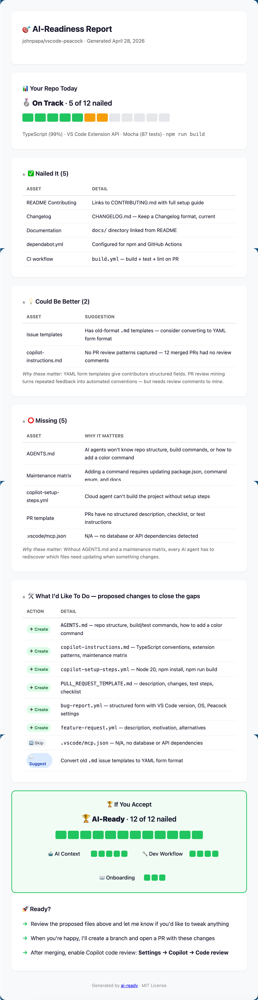

# AI Ready (a Copilot CLI Plugin)

[](https://github.com/johnpapa/ai-ready)

> ⚠️ **Experimental** — This plugin is under active development. It works, but expect rough edges. Feedback and contributions welcome.

A Copilot CLI plugin that analyzes your repository and generates the configuration files AI agents need to contribute correctly. **GitHub-native** — it auto-discovers your repo's context, community health, and PR review patterns without you explaining anything.

## Quick Start

Install the plugin:

```bash
copilot plugin install johnpapa/ai-ready
```

> 📦 Once [awesome-copilot marketplace](https://github.com/github/awesome-copilot) listing is live, install with `copilot plugin install ai-ready@awesome-copilot`

Run it:

```bash
copilot
```

Then type:

```
make this repo ai-ready
```

The plugin analyzes your code, CI, tests, docs, and structure, then generates assets customized to your project — not generic templates.

### Run it again anytime

The plugin is safe to re-run. On the first run, it creates missing assets. On subsequent runs, it **audits** your existing AI-ready files against the current state of your codebase — flagging drift like outdated build commands, stale repo structure, or new PR review patterns that should become conventions. It never overwrites your files — it suggests updates and lets you decide.

### Keeping updated

The plugin doesn't auto-update. To get the latest features and fixes:

```bash
copilot plugin install johnpapa/ai-ready
```

Re-running the install command pulls the latest version from the repo.

### Skip what you don't need

Add exclusions to your prompt and the skill will respect them:

```
make this repo ai-ready but skip CI and issue templates
```

```
just generate AGENTS.md and copilot-instructions
```

### Use without installing

If your organization restricts external plugins, you can use the skill directly — no plugin install needed.

**Add to a single repo** — copy the skill into your repo's `.github/skills/` directory:

```bash
mkdir -p .github/skills/ai-ready
curl -fsSL https://raw.githubusercontent.com/johnpapa/ai-ready/main/skills/ai-ready/SKILL.md \
  -o .github/skills/ai-ready/SKILL.md
```

**Add for all your repos** — copy it to your personal skills directory:

```bash
mkdir -p ~/.copilot/skills/ai-ready
curl -fsSL https://raw.githubusercontent.com/johnpapa/ai-ready/main/skills/ai-ready/SKILL.md \
  -o ~/.copilot/skills/ai-ready/SKILL.md
```

Then start `copilot` and say `make this repo ai-ready` — it works the same way. The tradeoff: you won't get automatic updates when the skill improves. Re-run the `curl` command to pull the latest version.

## What to Expect

After you run the skill, you get a full AI-readiness report — analysis, proposed changes, and a projected score. Here's what it looks like for [vscode-peacock](https://github.com/johnpapa/vscode-peacock):



> 🔗 [View the interactive version](https://johnpapa.github.io/ai-ready/examples/sample-report-peacock.html) — collapsible sections, responsive layout, works on mobile.

The report shows:
1. **Your Repo Today** — current score, what's nailed, what's missing, and why it matters
2. **What I'd Like To Do** — proposed files to create (nothing changes until you say so)
3. **If You Accept** — projected score with category breakdown
4. **Ready?** — offer to create a PR with all the changes

> 📄 Also available as [terminal output](examples/sample-report-peacock.md) — same content, rendered in the CLI.

### Scoring

Your score is simple: **how many of the 12 tracked assets are nailed.** That's it — no formulas, no weights.

| Medal | Name | Count | What it means |
|-------|------|-------|---------------|
| 🥉 | **Getting Started** | 1–4 of 12 | Basics are in place but AI agents are mostly guessing |
| 🥈 | **On Track** | 5–7 of 12 | AI agents can help but they'll miss your conventions |
| 🥇 | **Solid** | 8–10 of 12 | AI agents follow your patterns and catch most expectations |
| 🏆 | **AI-Ready** | 11–12 of 12 | AI agents contribute like your best team members |

## Why

Contributors (human and AI) show up to your repo and don't know the conventions. They submit PRs that miss tests, break patterns, skip docs. You leave the same review comments on every PR. AI agents make this more challenging — they generate PRs faster, but without context, those PRs create _more_ review burden.

It's the same gap from both sides: **contributors don't know what maintainers expect, and maintainers keep re-teaching it.** This plugin closes that gap by generating repo-level configuration that teaches everyone — human and AI — how to work in the repo correctly. It even mines your PR review comments for repeated feedback and turns them into automated conventions. The result: a 45-minute review becomes a 5-minute review.

### Built from Real Maintainer Experience

This plugin isn't theoretical — it's shaped by [John Papa](https://github.com/johnpapa)'s experience maintaining popular open source projects and repos at large enterprises. The skill is tuned to prioritize what actually reduces review burden: maintenance matrices that catch the files contributors always forget, conventions mined from the PR feedback you're tired of repeating, and CI that catches problems before you have to.

## How It Works — GitHub-Native by Default

You shouldn't have to explain to an AI tool that you're in a GitHub repo. This plugin assumes it, and leverages everything GitHub already knows about your project.

### Auto-Discovery (zero user input)

The skill starts by pulling context directly from GitHub — no questions asked:

| What it discovers | How | Why it matters |
|------------------|-----|----------------|
| Repo description, topics, languages | GitHub API | Knows what your project is without reading every file |
| Community health score | GitHub API | Instantly knows which config files are missing |
| Contributors | GitHub API | Team size, contribution patterns |
| Recent merged PRs | GitHub API | Understands what typical contributions look like |
| **PR review comments** | GitHub API | **Turns your repeated review feedback into automated conventions** |
| CI/CD workflows | GitHub Actions API | Knows your build/test pipeline |
| Releases | GitHub API | Understands versioning and release cadence |

It then scans your local codebase for deeper details — manifest files, test configs, directory structure, existing AI configuration — and combines both into a complete picture.

### PR Review Mining — The Killer Feature

This is the highest-value thing the plugin does. It reads your recent PR review threads and looks for **repeated feedback** — the same comments you leave on every PR:

- _"Please add tests for new features"_ → becomes a test convention rule
- _"Use the X pattern instead of Y"_ → becomes a coding convention rule
- _"Don't forget to update the changelog"_ → becomes a maintenance matrix entry
- _"This breaks on mobile, check responsive layout"_ → becomes a screen size rule

These mined conventions go directly into `copilot-instructions.md`. The next AI-generated PR follows those rules automatically. You stop repeating yourself.

### What Gets Generated

Every file is customized to your repo's actual language, framework, and patterns — not generic boilerplate. The skill only creates files that don't already exist.

| File | What It Does |
| --- | --- |
| **`AGENTS.md`** | Project context for the coding agent — repo structure, build/test commands, architectural decisions, how to add features |
| **`.github/copilot-instructions.md`** | Coding conventions for all Copilot interactions — Chat, completions, PR reviews, CLI. Includes a maintenance matrix of what to update when code changes |
| **`.github/copilot-setup-steps.yml`** | Cloud agent environment setup — runtime versions, dependencies, build steps |
| **`.github/workflows/ci.yml`** | PR validation pipeline — build, test, lint, typecheck. Skips non-code changes (docs, images, etc.) |
| **`.github/ISSUE_TEMPLATE/bug-report.yml`** | Structured bug report form with fields relevant to your project type |
| **`.github/ISSUE_TEMPLATE/feature-request.yml`** | Structured feature request form |
| **`.github/PULL_REQUEST_TEMPLATE.md`** | PR description template with checklist items derived from the maintenance matrix |
| **`CHANGELOG.md`** | Keep a Changelog format, populated from releases/tags if available |
| **`.vscode/mcp.json`** | MCP server config connecting AI agents to your project's databases, APIs, and tools |
| **README `## Contributing` section** | Onramp for new contributors — how to fork, build, test, and submit a PR |
| **AI-Ready badge in README** | Shields.io badge linking back to this plugin — added automatically |

### Why a Plugin?

The skill is the recipe. The plugin is how you keep it fresh. You can [use the skill without a plugin](#use-without-installing), but the plugin system adds convenience:

- **One-command install** — `copilot plugin install ai-ready@awesome-copilot`
- **Versioning and updates** — `copilot plugin update ai-ready`
- **Works on any repo** — install once, use everywhere

## Two Layers of PR Quality

The assets this plugin generates enable two complementary layers of PR quality — one you get automatically, one you enable:

| Layer | What it catches | How it works |
|-------|----------------|--------------|
| **CI workflow** (generated by this plugin) | Broken builds, failing tests, lint errors | GitHub Actions runs on every PR — validates that the code compiles and tests pass |
| **Copilot code review** (you enable this) | Convention violations, missing docs/tests, maintenance matrix gaps | Copilot reads `copilot-instructions.md` (generated by this plugin) and reviews PRs against your conventions |

Together: PRs are validated for **correctness** (CI) and reviewed for **quality** (Copilot). This plugin generates the inputs for both — the CI workflow and the conventions file that Copilot code review reads.

To enable Copilot code review: go to your repo's **Settings → Copilot → Code review** and turn it on. Once enabled, every PR is automatically reviewed against the conventions in `copilot-instructions.md`.

## Contributing

### Quick Start

1. Fork this repo and create a branch
2. Make your changes (skills, docs, or plugin config)
3. Verify `plugin.json` references are valid — every path in the `skills` array must point to a directory containing `SKILL.md`
4. Test locally: `copilot --plugin-dir /path/to/your/fork` then say *"make this repo ai-ready"*
5. Open a PR

See [AGENTS.md](AGENTS.md) for the full contributor guide.

## License

MIT
