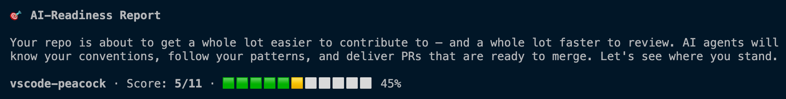

# AI Ready (a Copilot CLI Plugin)

> ⚠️ **Alpha** — This plugin is a work in progress. It works, but expect rough edges. Feedback and contributions welcome.

A Copilot CLI plugin that analyzes your repository and generates the configuration files AI agents need to contribute correctly. **GitHub-native** — it auto-discovers your repo's context, community health, and PR review patterns without you explaining anything.

## Quick Start

Install the plugin:

```bash
copilot plugin install johnpapa/ai-ready
```

Run it:

```
copilot "make this repo ai-ready"
```

The plugin analyzes your code, CI, tests, docs, and structure, then generates assets customized to your project — not generic templates.

## What to Expect

After you run the skill, here's what happens:

1. **Analysis** — the skill scans your repo using GitHub's APIs and your local codebase (languages, frameworks, CI, tests, PR review history, community health). No questions asked.
2. **Generation** — it creates any missing config files (AGENTS.md, copilot-instructions.md, CI workflow, issue templates, etc.), customized to your repo's actual patterns.
3. **Report** — you'll see an AI-Readiness Report showing your score, what's in place, and what was created or suggested.
4. **Next steps** — the skill will prompt you to review the generated files, enable Copilot code review, and create a PR.



## What It Does

Contributors (human and AI) show up to your repo and don't know the conventions. They submit PRs that miss tests, break patterns, skip docs. You leave the same review comments on every PR. AI agents make this more challenging — they generate PRs faster, but without context, those PRs are low-quality and create _more_ review burden.

This plugin fixes both sides by generating repo-level configuration files that teach AI agents and human contributors how to work in your repo correctly. It even mines your PR review comments for repeated feedback and turns them into automated conventions — so nobody keeps making the same mistakes you keep correcting. The result: PRs that are already close to merge-ready. Your job shrinks from "teach and review" to just "review the logic."

## The Two Problems It Solves

### Problem 1: The Contributor — "How do I contribute and get it merged?"

A developer (or AI agent) shows up wanting to contribute and hits a wall:

- _What patterns does this project follow?_
- _How do I make sure my PR gets accepted?_
- _What will the maintainer check during review?_

This knowledge lives in the maintainer's head. Some leaks into a CONTRIBUTING.md. Most gets re-explained in PR review comments — the same feedback, on every PR. The result: high ramp-up time, rejected PRs, frustrated contributors who don't come back.

### Problem 2: The Maintainer — "How do I review without the angst?"

On the other side, the maintainer dreads the PR queue:

- PRs that don't follow conventions — same review comments, over and over
- Missing tests, wrong patterns, broken docs, license issues
- Time spent explaining _how_ to do things instead of evaluating _what_ was done

### The Compounding Problem: AI Agent Volume

AI agents are accelerating contributions. That's great — but it's also flooding maintainers with more PRs than ever before. The volume is growing faster than any human can review.

**The irony:** AI makes it easier to _create_ contributions but does nothing to make them easier to _review_ — unless the repo tells the AI what good looks like.

### The Connection

These aren't separate problems. They're the same gap: the contributor doesn't know what the maintainer expects, and the maintainer keeps re-teaching it. If every AI-generated PR already follows conventions, passes tests, includes docs, and handles license compliance, a 45-minute review becomes a 5-minute review. The queue drains instead of growing.

## How It Works — GitHub-Native by Default

You shouldn't have to explain to an AI tool that you're in a GitHub repo. This plugin assumes it, and leverages everything GitHub already knows about your project.

### Auto-Discovery (zero user input)

The skill starts by pulling context directly from GitHub — no questions asked:

| What it discovers | How | Why it matters |
|------------------|-----|----------------|
| Repo description, topics, languages | GitHub API | Knows what your project is without reading every file |
| Community health score | GitHub API | Instantly knows which config files are missing |
| Contributors | GitHub API | Populates CODEOWNERS automatically |
| Recent merged PRs | GitHub API | Understands what typical contributions look like |
| **PR review comments** | GitHub API | **Turns your repeated review feedback into automated conventions** |
| CI/CD workflows | GitHub Actions API | Knows your build/test pipeline |
| Releases | GitHub API | Understands versioning and release cadence |

### PR Review Mining — The Killer Feature

This is the highest-value thing the plugin does. It reads your recent PR review threads and looks for **repeated feedback** — the same comments you leave on every PR:

- _"Please add tests for new features"_ → becomes a test convention rule
- _"Use the X pattern instead of Y"_ → becomes a coding convention rule
- _"Don't forget to update the changelog"_ → becomes a maintenance matrix entry
- _"This breaks on mobile, check responsive layout"_ → becomes a screen size rule

These mined conventions go directly into `copilot-instructions.md`. The next AI-generated PR follows those rules automatically. You stop repeating yourself.

### Then: Deep Codebase Analysis

With GitHub context in hand, the skill also scans your local code:

### Why is it a plugin and not just a skill file?

The skill is the recipe. The plugin is how you get it. Without the plugin wrapper, you'd have to manually find the `SKILL.md` file, copy it into your repo's `.github/skills/` directory, and keep it updated yourself. The plugin system handles all of that:

- **One-command install** — `copilot plugin install johnpapa/ai-ready`
- **Marketplace discovery** — listed and browsable so people can find it
- **Versioning and updates** — `copilot plugin update ai-ready`
- **Works on any repo** — install once, use everywhere

Think of it like npm: you don't _need_ npm to use a JavaScript file, but npm is how people discover, install, and update it.

## What Gets Generated

| Asset | What It Does |
| --- | --- |
| **`AGENTS.md`** | Project context for the coding agent — repo structure, build/test commands, architectural decisions |
| **`.github/copilot-instructions.md`** | Coding conventions for all Copilot interactions — Chat, completions, PR reviews, CLI |
| **`.github/skills/`** | Task-specific step-by-step recipes for common contribution patterns |
| **`.github/copilot-setup-steps.yml`** | Cloud agent environment setup — dependencies, tools, build steps |
| **CI workflow** | PR validation pipeline — build, test, typecheck |
| **Issue templates** | Structured proposals, bug reports, feature requests |
| **PR contribution guidance** | Fork → branch → build → test → PR workflow with repo-specific commands |
| **README contributing section** | Onramp for new contributors with skill examples and manual steps |
| **Maintenance matrix** | What to update when code changes — cross-referenced file dependencies |
| **License and content rules** | Asset review standards, attribution requirements, naming conventions |

## What It Analyzes

Between GitHub's APIs and your local codebase, the skill builds a complete picture:

- **GitHub metadata** — repo description, topics, language breakdown, community health score
- **Code patterns** — frameworks, conventions, file structures the project uses
- **Build and test toolchain** — what commands build the project, what test framework, what CI exists
- **PR review history** — what feedback maintainers repeat (these become conventions in `copilot-instructions.md`)
- **Contribution patterns** — what a typical PR looks like, what files get touched together
- **Issue patterns** — what categories of issues exist (these become issue templates)
- **Asset and dependency patterns** — licensing model, asset types (these become review rules)

Every generated file is customized to what it finds — not generic boilerplate.

## Two Layers of PR Quality

The assets this plugin generates enable two complementary layers of PR quality — one you get automatically, one you enable:

| Layer | What it catches | How it works |
|-------|----------------|--------------|
| **CI workflow** (generated by this plugin) | Broken builds, failing tests, lint errors | GitHub Actions runs on every PR — validates that the code compiles and tests pass |
| **Copilot code review** (you enable this) | Convention violations, missing docs/tests, maintenance matrix gaps | Copilot reads `copilot-instructions.md` (generated by this plugin) and reviews PRs against your conventions |

Together: PRs are validated for **correctness** (CI) and reviewed for **quality** (Copilot). This plugin generates the inputs for both — the CI workflow and the conventions file that Copilot code review reads.

To enable Copilot code review: go to your repo's **Settings → Copilot → Code review** and turn it on. Once enabled, every PR is automatically reviewed against the conventions in `copilot-instructions.md`.

## Contributing

### Quick Start

1. Fork this repo and create a branch
2. Make your changes (skills, docs, or plugin config)
3. Verify `plugin.json` references are valid — every path in the `skills` array must point to a directory containing `SKILL.md`
4. Test locally: `copilot --plugin-dir /path/to/your/fork` then say *"make this repo ai-ready"*
5. Open a PR

### Smoke Testing

Since this is a markdown-only plugin, the real test is running it:

```bash
# Load your local changes
cd /path/to/some-other-repo
copilot --plugin-dir /path/to/ai-ready

# Then invoke the skill
> make this repo ai-ready
```

Verify the analysis is correct and the generated files match the target repo's actual conventions.

See [AGENTS.md](AGENTS.md) for the full contributor guide.

## License

MIT
