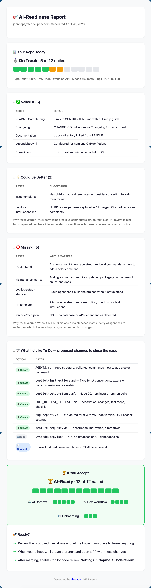

# AI Ready

[](https://github.com/johnpapa/ai-ready) [](https://github.com/johnpapa/ai-ready/releases/latest)

An [Agent Skill](https://agentskills.io) that analyzes your repository and generates the configuration files AI agents need to contribute correctly. **GitHub-native** — it auto-discovers your repo's context, community health, and PR review patterns without you explaining anything.

Works in **GitHub Copilot, Claude Code, OpenAI Codex, Cursor**, and any other tool that supports the Agent Skills
standard.

## Quick Start

### Any agent, one command

The open [skills CLI](https://github.com/vercel-labs/skills) installs into Claude Code, Codex, Cursor, Copilot,
and 70+ other agents:

```bash
npx skills add johnpapa/ai-ready
```

That's it — no per-tool setup. Restart your agent afterward.

### Native plugin installs

Prefer your tool's own plugin system? Each of these installs the same skill.

| Tool | Install |
|---|---|
| **GitHub Copilot CLI** | `copilot plugin install ai-ready@awesome-copilot` |
| **Claude Code** | `/plugin marketplace add johnpapa/ai-ready`<br>`/plugin install ai-ready@johnpapa-ai-ready` |
| **OpenAI Codex** | `codex plugin marketplace add johnpapa/ai-ready`<br>`codex plugin add ai-ready@johnpapa-ai-ready` |
| **Cursor** | Copy `skills/ai-ready/` into `~/.cursor/skills/ai-ready/` |
| **Anything else** | Copy `skills/ai-ready/` into `~/.agents/skills/ai-ready/` |

Claude and Codex each need **two** commands — the first registers the marketplace, the second installs the
plugin from it.

Copilot CLI installs from the built-in `awesome-copilot` marketplace. Installing straight from a repo
(`copilot plugin install johnpapa/ai-ready`) still works but is deprecated, so prefer the marketplace form.

`~/.agents/skills/` is the vendor-neutral [Agent Skills](https://agentskills.io) directory that Codex and Cursor
both read, so the last row works for most tools.

If a marketplace mirrors this skill, it should point to a release tag such as `v1.4.0`, not a raw commit SHA.

### Then type

```
make this repo ai-ready
```

Or invoke it explicitly:

| Tool | Invoke |
|---|---|
| Claude Code, Cursor, Copilot CLI | `/ai-ready` |
| OpenAI Codex | `$ai-ready` |

When installed as a plugin from a marketplace, Claude namespaces it as `/ai-ready:ai-ready`.

The skill analyzes your code, CI, tests, docs, and structure, then generates assets customized to your project — not generic templates.

### Run it again anytime

The skill is safe to re-run. On the first run, it creates missing assets. On subsequent runs, it **audits** your existing AI-ready files against the current state of your codebase — flagging drift like outdated build commands, stale repo structure, or new PR review patterns that should become conventions. It never overwrites your files — it suggests updates and lets you decide.

### Keeping updated

| Tool | Update |
|---|---|
| skills CLI | `npx skills update` |
| GitHub Copilot CLI | `copilot plugin update ai-ready` |
| Claude Code | `/plugin marketplace update johnpapa-ai-ready` |
| Codex | `codex plugin marketplace upgrade` |

### Troubleshooting

<details>
<summary><b>The agent doesn't use the skill</b></summary>

1. **Restart your agent.** Most tools only scan for skills at startup.
2. **Confirm it's installed.** Run `npx skills list`, `copilot plugin list`, `claude plugin list`, or
   `codex plugin list` depending on how you installed it.
3. **Check you finished both steps.** Claude and Codex need a marketplace command *and* an install command.
4. **Ask for it by name** — `/ai-ready` (or `$ai-ready` in Codex) — to rule out matching problems.

</details>

<details>
<summary><b>Install fails with a "reference is not a tree" or SHA error</b></summary>

The marketplace entry is pointing at a commit SHA. Plugin installs clone with `git clone --branch <ref>`, which
only accepts a branch or tag, so a raw SHA always fails. The registry entry needs to use a release tag such as
`v1.3.0`. See [#26](https://github.com/johnpapa/ai-ready/issues/26).

Installing directly from this repo (`copilot plugin install johnpapa/ai-ready`) avoids the problem entirely.

</details>

<details>
<summary><b>Claude marketplace add fails over SSH</b></summary>

If `/plugin marketplace add` fails with a Git authentication error, use the full HTTPS URL:

```
/plugin marketplace add https://github.com/johnpapa/ai-ready
```

Or tell Git to prefer HTTPS for GitHub:

```bash
git config --global url."https://github.com/".insteadOf git@github.com:
```

</details>

### Skip what you don't need

Add exclusions to your prompt and the skill will respect them:

```
make this repo ai-ready but skip CI and issue templates
```

```
just generate AGENTS.md and the per-tool pointer files
```

### Report only

Just want to see where you stand? Ask for a report without generating any files:

```
how ai-ready is this repo?
```

```
score this repo
```

## What to Expect

After you run the skill, you get a full AI-readiness report — analysis, proposed changes, and a projected score. Here's what it looks like for [vscode-peacock](https://github.com/johnpapa/vscode-peacock):



> 🔗 [View the interactive version](https://johnpapa.github.io/ai-ready/examples/sample-report-peacock.html) — collapsible sections, responsive layout, works on mobile.

The report shows:
1. **Your Repo Today** — current score, what's nailed, what's missing, and why it matters
2. **What I'd Like To Do** — proposed files to create (nothing changes until you say so)
3. **If You Accept** — projected score with category breakdown
4. **Ready?** — offer to create a PR with all the changes

Issue/PR messages generated by this skill always include explicit attribution to the **AI Ready** skill. It also keeps related docs aligned to repo standards and proactively attempts conflict resolution before opening PRs (or asks when manual help is needed).

> 📄 Also available as [terminal output](examples/sample-report-peacock.md) — same content, rendered in the CLI.

### Scoring

Your score is **how many of the 11 tracked assets are nailed** — no formulas, no weights. Two of the medals have one extra requirement.

| Medal | Name | Count | Also required | What it means |
|-------|------|-------|---------------|---------------|
| 🥉 | **Getting Started** | 1–3 of 11 | — | A few of the files exist. Nothing in the repo tells an agent how it works |
| 🥈 | **On Track** | 4–6 of 11 | — | Real scaffolding is in place, but the conventions are still in people's heads |
| 🥇 | **Solid** | 7–9 of 11 | `AGENTS.md` nailed | The conventions are written down, in the one file every tool reads |
| 🏆 | **AI-Ready** | 10–11 of 11 | every 🤖 AI Context asset nailed | Conventions, boundaries, reviewers and procedures all live in the repo |

**Why the two extra requirements.** A repo can reach seven nailed assets on a changelog, docs, issue templates, a PR template, CI, and two reviewer agents — with no `AGENTS.md` at all. That repo is well maintained. It is not AI-ready, and a plain count would hand it 🥇. So the count is a ceiling rather than a score: without `AGENTS.md` the repo stops at 🥈 no matter how high the count climbs. When a medal is capped, the report says which prerequisite is missing and what would lift it.

**What the score doesn't tell you.** It measures what's *in place*, not whether agents write better pull requests in your repo. Nobody has measured that, here or anywhere, and this skill won't quote you a number.

## Why

Contributors (human and AI) show up to your repo and don't know the conventions. They submit PRs that miss tests, break patterns, skip docs. You leave the same review comments on every PR. AI agents make this more challenging — they generate PRs faster, but without context, those PRs create _more_ review burden.

It's the same gap from both sides: **contributors don't know what maintainers expect, and maintainers keep re-teaching it.** This skill closes that gap by generating repo-level configuration that teaches everyone — human and AI — how to work in the repo correctly. It even mines your PR review comments for repeated feedback and turns them into written conventions, so the thing you keep saying in reviews is in the repo instead of in your head.

### Built from Real Maintainer Experience

This skill isn't theoretical — it's shaped by [John Papa](https://github.com/johnpapa)'s experience maintaining popular open source projects and repos at large enterprises. It prioritizes the things maintainers keep re-explaining: maintenance matrices for the files contributors forget, conventions mined from the PR feedback you're tired of repeating, and CI that catches problems before a person has to.

## How It Works — GitHub-Native by Default

You shouldn't have to explain to an AI tool that you're in a GitHub repo. This skill assumes it, and leverages everything GitHub already knows about your project.

### Auto-Discovery (zero user input)

The skill starts by pulling context directly from GitHub — no questions asked:

| What it discovers | How | Why it matters |
|------------------|-----|----------------|
| Repo description, topics, languages | GitHub API | Knows what your project is without reading every file |
| Community health score | GitHub API | GitHub already tracks which community files are missing — no need to look |
| Contributors | GitHub API | Team size, contribution patterns |
| Recent merged PRs | GitHub API | Understands what typical contributions look like |
| **PR review comments** | GitHub API | **Turns your repeated review feedback into automated conventions** |
| CI/CD workflows | GitHub Actions API | Knows your build/test pipeline |
| Releases | GitHub API | Understands versioning and release cadence |

It then scans your local codebase for deeper details — manifest files, test configs, directory structure, existing AI configuration — and combines both into a complete picture.

### PR Review Mining

The skill reads your recent PR review threads and looks for **repeated feedback** — the same comments you leave on every PR:

- _"Please add tests for new features"_ → becomes a test convention rule
- _"Use the X pattern instead of Y"_ → becomes a coding convention rule
- _"Don't forget to update the changelog"_ → becomes a maintenance matrix entry
- _"This breaks on mobile, check responsive layout"_ → becomes a screen size rule

These mined conventions go directly into `AGENTS.md`, where every tool reads them. The next AI-generated PR follows those rules automatically. You stop repeating yourself.

### What Gets Generated

Every file is customized to your repo's actual language, framework, and patterns — not generic boilerplate. The skill only creates files that don't already exist.

| File | What It Does |
| --- | --- |
| **`AGENTS.md`** | **The single source of truth.** Repo structure, build/test commands, architectural decisions, how to add features, coding conventions, conventions mined from your PR reviews, and the maintenance matrix. Read by Copilot, Claude Code, Codex and Cursor alike |
| **Per-tool pointer files** | `.github/copilot-instructions.md`, `CLAUDE.md`, `.cursorrules` — three lines each, pointing at `AGENTS.md`. One file holds the content; everything else points at it, so nothing drifts |
| **`.github/agents/*.agent.md`** | Three **reviewer agents** you assign to a PR — one checks the diff against what the issue actually asked for, one checks whether the tests would have failed against the old code, and one checks what a revert would not undo. Each asks a question that can come back _no_, works from the diff alone, and has no way to say _ship it_ |
| **`.github/skills/*/SKILL.md`** | A starter skill built from your maintenance matrix, so the "when you change X you must also change Y" knowledge runs as a procedure instead of sitting in a list |
| **`.github/skills/security-review/`** | A security skill — generated only when the repo has real surface, and populated from your `SECURITY.md`, your own review comments, and your actual trust boundaries. No generic checklist |
| **`.github/workflows/ci.yml`** | PR validation pipeline — build, test, lint, typecheck. Skips non-code changes (docs, images, etc.) |
| **`.github/ISSUE_TEMPLATE/bug-report.yml`** | Structured bug report form with fields relevant to your project type |
| **`.github/ISSUE_TEMPLATE/feature-request.yml`** | Structured feature request form |
| **`.github/PULL_REQUEST_TEMPLATE.md`** | PR description template with checklist items derived from the maintenance matrix |
| **`CHANGELOG.md`** | Keep a Changelog format, populated from releases/tags if available |
| **`.mcp.json`** | MCP server config connecting AI agents to your project's databases, APIs, and tools |
| **README `## Contributing` section** | Onramp for new contributors — how to fork, build, test, and submit a PR |
| **AI-Ready badge in README** | Shields.io badge linking back to this skill — added automatically |

## Three Layers of PR Quality

The assets this skill generates enable three complementary layers of PR quality — one you get automatically, one you enable, and one you assign:

| Layer | What it catches | How it works |
|-------|----------------|--------------|
| **CI workflow** (generated by this skill) | Broken builds, failing tests, lint errors | GitHub Actions runs on every PR — validates that the code compiles and tests pass |
| **Copilot code review** (you enable this) | Convention violations, missing docs/tests, maintenance matrix gaps | Copilot reads `copilot-instructions.md` (generated by this skill) and reviews PRs against your conventions |
| **Reviewer agents** (you assign these) | A diff that does something nobody asked for, tests that would have passed against the old code, a change a revert will not undo | You assign an agent from `.github/agents/` to a PR. Each asks a single question the other two layers don't — and asks it with a different objective from whoever wrote the code |

Together: PRs are validated for **correctness** (CI), reviewed for **quality** (Copilot), and interrogated for **intent** (reviewer agents). This skill generates the inputs for all three.

**Run reviewer agents on different models where you can.** A review agent on one model catches things an agent on another walks straight past, on the same diff. Three reviewer agents all on one model is one reviewer with three prompts.

To enable Copilot code review: go to your repo's **Settings → Copilot → Code review** and turn it on. Once enabled, every PR is automatically reviewed against the conventions in `copilot-instructions.md`.

## Adversarial agents

This is a practice, not something the skill generates. It doesn't require this repo at all — use it on
anything an AI tool hands you, before you act on it.

**An agent produces something, and you check it with a genuinely different agent before you trust it.** Write
the code with Claude, then have GitHub Copilot review the diff on its own. Get a security review from one
tool, then ask a different one what the first review didn't look at. The two tools don't share blind spots,
so running both catches what running one twice never will.

This applies to more than pull requests: a migration plan, a root-cause analysis, a generated `AGENTS.md` —
anything you're about to act on. And it applies to a **clean result**, not just a list of findings. "The
security review found nothing" is still just one tool's output. *What did it not look at?* is the question
that turns a clean pass into information.

Reviewer agents (above) are one way to automate a narrow slice of this inside a single repo. Adversarial
agents are the broader habit: whenever the stakes are real, get a second, different tool's opinion before you
trust the first one's.

## Tested Against

This skill has been validated against a diverse set of repos — courses, applications, VS Code extensions, monorepos, and more. See [docs/training-repos.md](docs/training-repos.md) for the full list.

## Contributing

### Quick Start

1. Fork this repo and create a branch
2. Make your changes (skills or docs)
3. Test locally: copy `skills/ai-ready/SKILL.md` to `~/.copilot/skills/ai-ready/SKILL.md`, start `copilot`, then say *"make this repo ai-ready"*
4. Open a PR — name the repo you tested against in the **Tested On** table

CI will reject a PR for invalid skill frontmatter, unparseable YAML, a version bump that misses one of the five plugin manifests, an Agent Skills spec violation, a skill the `skills` CLI can't discover, a `skills.sh.json` that's out of step with `skills/`, a risk-path glob that stops matching its fixtures, a generated detection table that has drifted from the data it comes from, or a context file over its line budget (`SKILL.md` 500, `AGENTS.md` 150). What it **can't** catch is a skill instruction that's simply wrong — the packaging validates either way. That's what step 3 is for, and why the PR template asks which repo you ran it on.

See [AGENTS.md](AGENTS.md) for the full contributor guide and the complete list of what CI enforces.

## Credits

This skill was strengthened using:

- **[Sensei](https://github.com/spboyer/sensei)** — AI skill quality scorer that evaluates frontmatter, structure, and discoverability. Used to achieve a "High" rating.
- **[Agent Skills Spec](https://github.com/github/awesome-copilot/blob/main/docs/README.skills.md)** — GitHub's specification for skill authoring. Used to refactor from 964 lines to a 225-line spec-compliant structure with progressive disclosure.

## License

MIT
